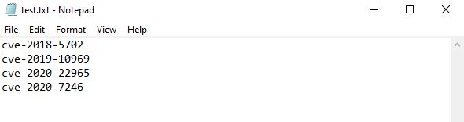

## About
This script requires you to feed it with a txt file with the cve numbers in it, in the following format


It will perform a google search based on each CVE number in the file and will create a CSV file with details such as CVE Number, Author, Title, Date Published and a link to the webpage to find out more details

## Requirements
Tested and working with Python 3.9

```
git clone https://github.com/Transcendence-hay-hay/Python-Project.git
pip3 install -r requirements.txt
```

## Pending
- Will add more columns to the csv file with more data obtained regarding each CVE
- Will make use of Panda to do some data manipulation and analysis
- Need to source for data from more websites, 
e.g. 
https://nvd.nist.gov/vuln/detail/CVE-xxxx-xxxx
https://rapid7.com/db/vulnerabilities/xxxxxxxxx


